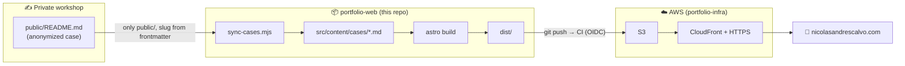

# 🌐 portfolio-web

My engineering portfolio site: problem-first write-ups on AWS, infrastructure and DevOps,
built with [Astro](https://astro.build) and deployed to AWS. Companion infra lives in
[`portfolio-infra`](https://github.com/NicolasAndresCalvo/portfolio-infra).

## 🗺️ How it all fits together



The diagram is the index: content is authored elsewhere, synced in (public parts only), built,
and shipped to AWS by the pipeline.

## 🧭 In plain terms

I write each case once, privately, with real names and numbers. A script pulls only the
**anonymized** public version into this site, so client names never reach the public repo,
not even in the URL. Then a push deploys it.

## 🧩 What's inside

| Path | What |
|------|------|
| `src/pages/` | home, `/cases`, `/cases/[slug]`, `/tags` (topics), `/about` |
| `src/content/cases/*.md` | the articles (synced from the workshop, committed so CI can build) |
| `src/content.config.ts` | frontmatter schema (`title, date, slug, draft, tags, summary`) |
| `scripts/sync-cases.mjs` | copies public case write-ups in, slug from frontmatter |
| `scripts/deploy.sh` | build + push to S3 (+ CloudFront invalidation) |
| `.github/workflows/deploy.yml` | CI: build and deploy on push to `main` (AWS OIDC) |

## 🛠️ Develop

```bash
npm install
npm run dev      # sync + dev server (drafts visible)
```

## 🚀 Build & deploy

```bash
npm run build        # local: sync + build
npm run build:ci    # CI: build only (content already committed)
```

CI deploys on push to `main` via AWS OIDC. It reads these repo settings:

| Kind | Name | Purpose |
|------|------|---------|
| variable | `CI_ENABLED` | master switch (`true` to deploy) |
| secret | `AWS_DEPLOY_ROLE_ARN` | role the pipeline assumes |
| variable | `AWS_REGION` / `AWS_S3_BUCKET` | where to ship |
| variable | `CLOUDFRONT_DISTRIBUTION_ID` | cache invalidation (phase 2) |

## ✍️ Add a case

Write it in the workshop (anonymized public version), then here:

```bash
npm run sync     # pull the new public case in
git add -A && git commit -m "content: add <case>" && git push
```

The frontmatter `slug:` controls the public URL. `draft: true` hides a case in production.
