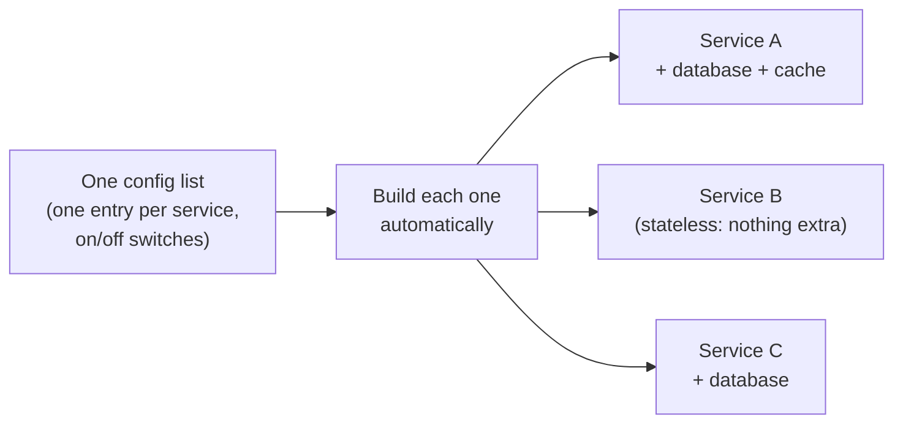
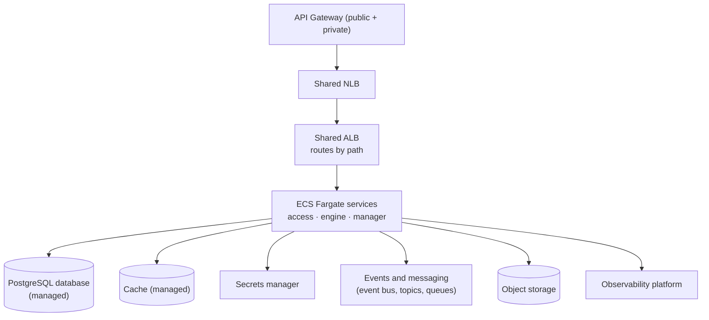

# Disposable Compute Is the Easy Part: Designing Volatile Architectures on ECS Fargate

"Cattle, not pets." "Stateless and disposable." "Immutable infrastructure." If you have spent any time around cloud-native teams, you have heard these repeated until they sound like a checkbox: pick a container service, do not SSH into the box, done.

That framing hides where the actual work is. Making a single container disposable is trivial: ECS Fargate gives you that out of the box. The hard part is making *everything around it* assume the machine is temporary. How you create the next service, how requests reach it, how you watch it, how you ship to it: all of that has to stop depending on any individual, long-lived box. If the container is disposable but standing up service number eight means copy-pasting service number seven's setup, you still have pets. You just moved them into the wiring.

This is how a cohort of services was designed for genuinely disposable compute, built directly on AWS ECS Fargate for an airline's platform for flight add-ons (the paid extras around a flight). No companies are named. The point is the design.

---

## In plain terms

Think of renting a kitchen by the hour instead of owning one. The cooks (the services) get a fresh, clean kitchen each time and hand it back when done. That is cheaper and more flexible. But it only works if everything around the kitchen assumes it is temporary: the ingredients, the recipes and the keys all live somewhere permanent, never on the kitchen counter, because the counter gets wiped between shifts.

## What "disposable" actually demands

The idea is not new, and it is worth grounding rather than sloganeering. Compute that is **stateless and disposable** means nothing important lives on the machine: the data, the secrets and the configuration all live in managed services around it, so any container can be thrown away and replaced at any moment without losing anything.

The same principle shows up across the industry under different names: the **Twelve-Factor App** (factor VI, processes are stateless and share nothing; factor IX, processes are disposable), **"cattle, not pets"** (coined by Bill Baker, popularized by Randy Bias), and **immutable infrastructure** (you replace machines instead of modifying them).

> References: [12factor.net/disposability](https://12factor.net/disposability) ·
> [12factor.net/processes](https://12factor.net/processes) ·
> [CNCF: immutable infrastructure](https://glossary.cncf.io/immutable-infrastructure/) ·
> [pets vs cattle, origin](http://cloudscaling.com/blog/cloud-computing/the-history-of-pets-vs-cattle/)

A team I worked with called this cohort its "volatile architectures." It is an internal name for the established principle above, not a new concept. Holding that principle honestly is what forces the decisions below.

## Decision 1: create services from one config list, not by copying the last one

The clearest test of disposable infrastructure is how cheaply you can create the *next* service. The usual failure mode is that each new service is a copy of the previous one, with a few names changed, which quietly turns every service into a hand-maintained pet.

Instead, each group of services is described as **a single configuration list**. Every entry is a service, and a set of on/off switches says what that service needs: a database? a cache? a public address? The infrastructure builds each one automatically and only provisions the database or cache for the services that asked for one.

The payoff: one source of truth, **adding a service is a single line**, every service is built the same way, and bad settings are caught automatically before anything is created. This is what "disposable" looks like applied to creation, not just to runtime.

## Decision 2: one shared, path-routing load balancer instead of one per service

The reflex is one load balancer per service. It feels clean and isolated. It is also needless cost: a balancer is a fixed monthly charge whether it fronts one service or many.

The cohort shares **a single application load balancer that routes by path** to the right service. Same isolation at the routing layer, a fraction of the cost: on the order of **150 USD per month per environment** saved, repeated across every environment.

## Decision 3: a managed backbone, so the container can own nothing

For the container to be truly disposable, everything stateful has to live somewhere else. Requests come in through public and private API gateways, through a shared network balancer and the shared path-routing balancer, to the ECS Fargate services. Around them sits a fully managed backbone, and each service opts into only what it needs:

The services group by role: **access** (read and write to data and downstream systems), **engine** (decision and processing logic) and **manager** (orchestration and catalog). Delivery is standardized and secretless: it runs on the company's shared pipeline building blocks with short-lived automatic credentials instead of stored passwords. Observability sends application errors and traces to the company's existing monitoring platform rather than spinning up a costly, duplicated log stream.

## The scaling limit nobody had written down

The interesting problems in platform work are rarely in the docs. While growing the cohort, I hit a hidden scaling limit in the underlying platform, the kind of ceiling that does not show up until you are close to it and then blocks growth hard.

The fix was not to fight the limit but to **diagnose it and route around it** before it became a wall: understand exactly which resource was capped, and restructure the design so the cohort could keep growing without crossing it. This is the part of "disposable infrastructure" the slogans never mention: disposable compute still runs on a platform with finite, sometimes undocumented, edges, and someone has to find them before production does.

## By the numbers

- **7 services** built from the shared configuration (3 access, 2 engine, 2 manager), across **3 environments**.
- **5 of them use a database** and **5 use a cache**, switched on per service, so the rest run with neither.
- **One shared load balancer** for the whole group instead of one per service, saving on the order of **150 USD per month per environment**.
- **Adding a new service is one line** in the configuration.

## What was hard, and what I would do differently

- **One branch with per-environment folders is convenient, and risky.** All three environments (integration, pre-production, production) lived as folders on a single branch, with the pipelines promoting from there. It keeps everything in one place, but the structure makes it easy to drag a change into a higher environment that is not ready, because a shared edit can ripple across all environments at once. I would add stronger promotion gates and separate the shared changes from the per-environment ones, so nothing can reach production before it is meant to.

## The transferable lesson

"Disposable compute" is sold as a property of the container. It is really a property of the system around the container. The container being replaceable is free. Making the *creation* of the next service a single line, making routing shared instead of per-service, making state live in managed services and finding the platform's hidden edges: that is the work, and that is what makes "cattle, not pets" true past the first server.

---

*Names, identifiers and exact internal figures are generalized. Costs are list-price approximations, meant to show the order of magnitude.*
