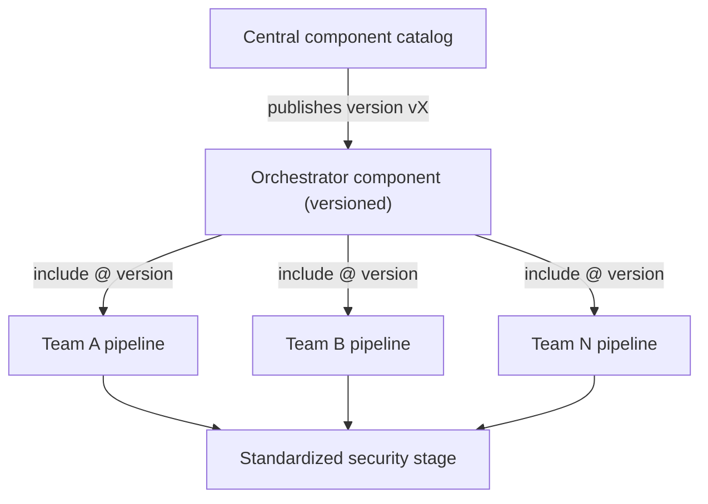
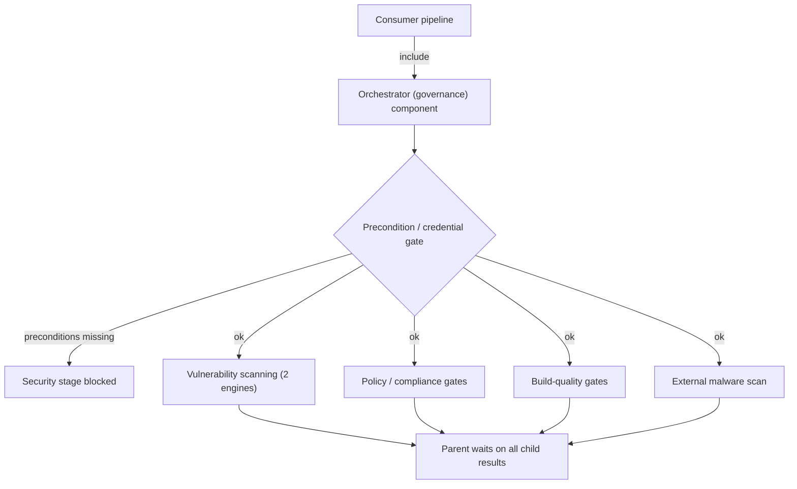

# GitLab Components for Governance: Standardizing CI Across an Org

There is a tidy story platform teams like to tell: write a shared CI template, ask everyone to include it, and the whole org becomes consistent. It feels like governance. It mostly is not.

The moment a "shared" pipeline is something each team copies into its own config, it stops being shared. Copies drift. A policy fix lands in one repo and not the other forty. Six months later "everyone runs the same security scan" is true on a slide and false in the code.

This is how a large engineering org moved from copy-pasted security CI to actual governance: versioned, reusable components behind a single orchestrator that teams adopt in one line, where the required checks cannot be quietly skipped. No company or tool is named here. The point is the pattern.

## In plain terms

Picture every team wiring its own smoke alarms: same idea, slightly different each time, some batteries dead, nobody sure which houses are actually covered. The fix is not a better instruction sheet. It is a single certified safety kit you plug in, maintained centrally and versioned, that arrives wired for every required check at once. You opt into a new version on purpose, never by accident.

## The problem: copy-paste is not a standard

Each team owned its own pipeline definition, and the security and compliance logic (vulnerability scanning, license checks, image quality gates) was copied from one config to the next. That produced the familiar failure modes:

- **Drift.** Every copy of the "same" scan diverged over time. Fixes and policy changes had to be re-applied by hand in dozens of places, so most copies were stale.
- **Duplication.** The same scanner wiring was reimplemented again and again, each with its own auth handling, failure behavior and hardcoded values.
- **Weak enforcement.** Nothing guaranteed a pipeline actually ran the required checks. A missing or misconfigured input often failed silently and the pipeline went green anyway.
- **Uncoordinated versions.** Teams pointed at moving branch tips instead of fixed releases, so pipeline behavior could change underneath them with no warning.

The throughline: a standard you have to copy is not a standard. It is a suggestion with extra steps.

## The shift: from copied YAML to versioned components

The foundation was a central catalog of versioned, reusable CI components. Each scanner is published once as a standalone component and referenced by version, never pasted:

- Teams reference a component by path and version tag, not by copying YAML.
- New releases are cut as new version tags. Consumers opt into an upgrade by bumping the tag.
- The standard path is to reference one orchestrator component, which internally references the scanner components, so a team gets the whole governed bundle from a single line.

One published artifact, many consumers, all pinned to a version they chose.

## The governance layer: a standard nobody can skip

The orchestrator is the actual governance. Instead of hand-assembling a security stage, a team adopts one component and gets the whole enforced bundle:

- **Mandatory scans as one bundle.** Pulling in the orchestrator automatically wires up the full required set of security and compliance scanners. You cannot accidentally ship a pipeline that skips a required check.
- **One merged input schema.** Rather than every scanner exposing its own contract, the orchestrator presents a single unified input surface (several dozen parameters) and maps each value through to the right scanner.
- **A required, isolated security stage.** All scanners run in one dedicated stage, and the parent pipeline waits on every child result before moving on.
- **Pinned versions.** The orchestrator references each scanner at a fixed release, so behavior is reproducible instead of tracking a moving branch.
- **Global gating.** A shared rule blocks the whole security stage unless the required preconditions are present, and gate-style scanners fail the job on a negative compliance verdict or a severity threshold.

Under the hood it is a fan-out: the orchestrator defines one job per scanner, and each job triggers that scanner's component as a child pipeline with a curated, validated set of inputs. Consumers include only the orchestrator, never the individual scanners.

The bundle covers roughly half a dozen scanners: vulnerability scanning (image and SBOM based, more than one engine), policy and compliance gates that fail on a negative verdict, build-quality gates (base-image currency, image-layer efficiency), and an external malware scan through a remote service.

## By the numbers

- Adopted across **dozens of internal teams and pipelines**.
- **About half a dozen** scanner components unified behind one orchestrator.
- **Several dozen** input parameters normalized into a single schema.
- Rolled out in a **controlled, early-adoption** posture: versioned releases hardening toward general availability.

## My role

I led the orchestration and integration layer, not the individual scanners (several of which wrapped upstream tools owned by other teams). Concretely:

- Designed and built the **central orchestrator component**: the merged schema and the fan-out.
- Authored the **integration glue**, mapping the unified input surface through every scanner and surfacing the mismatches and silent-failure traps between contracts.
- Owned the **reference implementation, onboarding guide and per-scanner docs**, so teams could self-serve adoption.
- Kept a running **known-issues log** for the framework's operational sharp edges.

It is a systems-integration role: owning the coordinated whole rather than each tool.

## What was hard, and what I would do differently

The honest weak point is **keeping the input contract in sync.** Each scanner's parameters live in two places: the scanner's own component and the orchestrator's merged schema. Nothing automatically ties them together, so if a scanner adds or renames an input and the orchestrator is not updated in lockstep, the orchestrator silently drops or stale-defaults that value. Green pipeline, wrong behavior. That manual, cross-repo contract maintenance is the framework's load-bearing weakness, and the first thing I would automate: a check that fails the build when the two schemas diverge.

Two smaller edges: a global credential gate that is coarser than it should be (it can block scanners that do not need those credentials), and the constant temptation to pin to a moving branch instead of a release tag, which quietly reintroduces the exact drift the framework exists to kill.

## The transferable lesson

Centralizing CI is not about shared snippets. Snippets get copied, and copies drift. Governance is three things working together: **reusable components** so there is one real source, **versioning** so upgrades are deliberate, and **a single adoption point** so the required checks cannot be skipped by accident. The goal is not "we published a standard." It is "you cannot ship without it, and upgrading is a choice you make on purpose."

---

*Names, identifiers and exact figures are generalized. Counts are approximate ranges.*
