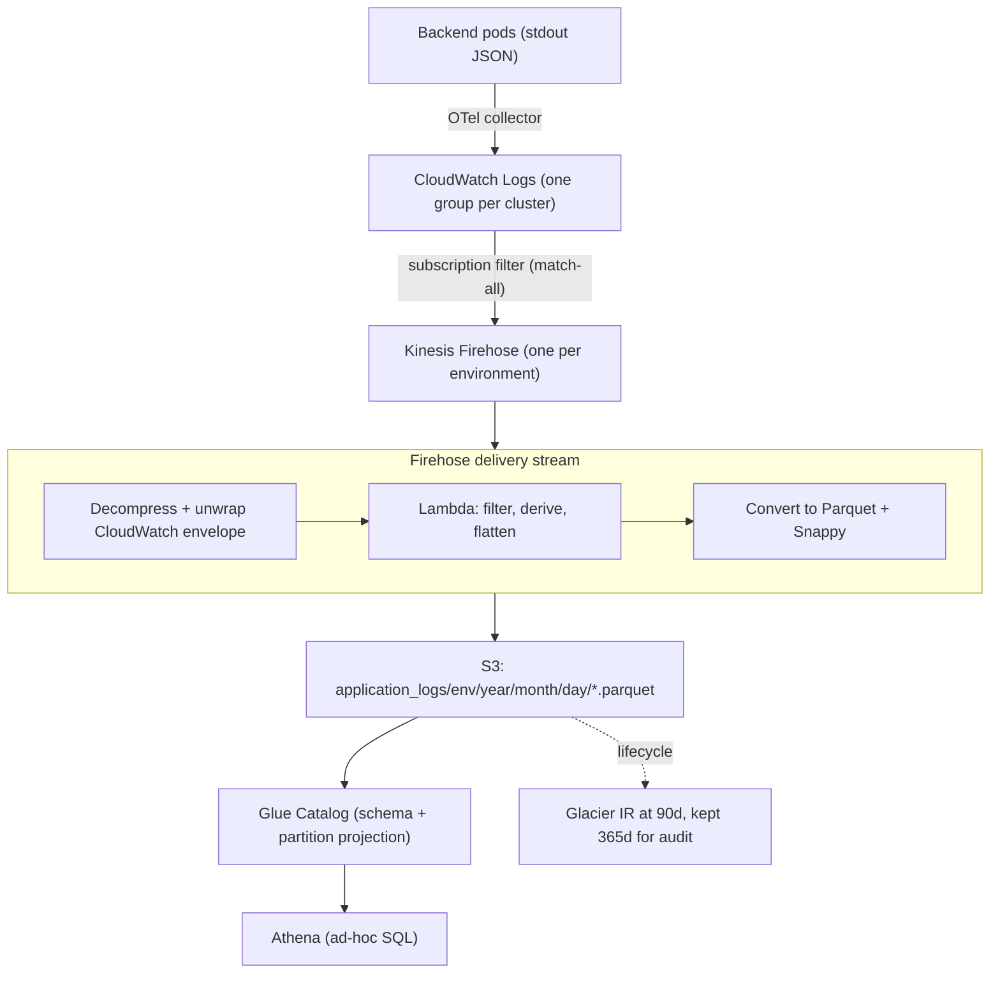

# Drowning in Logs, Starving for Answers

> **TL;DR** A production Kubernetes cluster was already shipping 25 million structured log lines and 62 GB a day into CloudWatch, in that one environment alone, but the only way to explore them was a slow, per-query log scanner. I built a pipeline that filters, flattens and converts every log into columnar **Parquet** on S3, catalogued in Glue, so operators can query the whole fleet with **plain SQL in Athena** and a one-day, one-service question scans megabytes instead of gigabytes.

Two things are usually true at once on a mature platform: the logs already exist, and nobody can actually use them. They land in a log service, they are searchable one narrow time window at a time, and the moment you want to ask something analytical, "rank services by error rate today", "trace this transaction across services", "which endpoints are slowest", you are stuck. The interactive log scanner does not scale to that volume, and it is not SQL.

This is the pipeline that solves it: the same logs, turned into a columnar table you can query with SQL, cheaply, with no crawlers and no operational catalog to babysit. It was designed and validated end to end in a lower environment; the production go-live is the next step.

## In plain terms

The application was already writing a diary, one line per thing that happened, and dropping every page into a giant filing cabinet. You could pull one folder at a time and read it, but you could not ask the cabinet a question like "how many red-ink entries did the payments desk write yesterday?" I did not change what gets written. I added a machine that reads each page as it arrives, keeps the useful ones, files them by column instead of by page, and hands you a spreadsheet you can query. Now the question takes seconds and reads almost nothing.

## The problem

The platform's backend services log as **structured JSON** (one shared logging library across all services), and a collector already centralizes every pod's stdout into CloudWatch. So the raw material was there and clean. What was missing was any way to treat it as data:

- The interactive log scanner charges per query by bytes scanned, and at this volume every broad question was slow and expensive.
- There was no schema, so no `GROUP BY`, no joins, no `ORDER BY duration DESC`.
- Answering "which service throws the most errors today?" meant eyeballing windows, not running a query.

## The insight

The logs were already being centralized by an **OpenTelemetry collector** (the AWS distribution of OTel) into a single log group per cluster. I did not need a new agent on the nodes or a change to the applications. The pipeline could **start where the collector finishes**: subscribe to that log group and take it from there. One source of truth, every environment, no cross-account plumbing.

## The architecture



Logs flow from pods to CloudWatch untouched. A subscription filter fans each environment's stream into its own Firehose, which decompresses, unwraps, runs a Lambda, and writes Parquet to a private bucket. Glue holds the schema and the partitions; Athena is the query surface.

## The pipeline in four steps

1. **Capture.** The OTel collector already centralizes every pod's stdout. A per-environment subscription filter forwards it to that environment's Firehose. The filter is match-all on purpose (more on that below).
2. **Ingest and transform.** Firehose decompresses the gzip, expands the CloudWatch envelope into individual events, runs them through the Lambda, and converts the result to Parquet with Snappy compression.
3. **Normalize (the Lambda).** For each event: drop the service-mesh sidecar and anything outside the whitelist, derive the business `domain` and the `env`, parse the application's JSON, and flatten the useful fields into columns.
4. **Query.** Glue publishes the schema and partitions; Athena runs SQL and scans only the partitions named in the `WHERE`.

## Two layers, and why flattening matters

Each event arriving in CloudWatch is nested. The collector wraps the application's log in an envelope of Kubernetes metadata:

```jsonc
// Layer 1: the envelope the collector adds (k8s context)
{
  "attributes": {
    "time": "...",
    "log.iostream": "stdout",
    "log": "{...}"                       // layer 2 lives in here
  },
  "resource": {
    "k8s.namespace.name": "payments",
    "k8s.container.name": "payments-api",
    "k8s.pod.name": "payments-api-7c9d...-abcde"
  }
}

// Layer 2: the JSON the service itself emits (shared logging library)
{
  "level": "INFO",
  "class": "...ActivityLogHandler",
  "message": "Request information",
  "instance": "payments-api",
  "type": "Activity",
  "trace_id": "6a38e94d...",
  "span_id": "ca3a0931...",
  "duration": "267"
}
```

The Lambda promotes a field to a column only if it appears in almost every log **and** is worth filtering, grouping or sorting on: `level`, `namespace`, `container_name`, `trace_id`, `duration_ms`, and a handful more. Everything else (response bodies, headers, nested protocol objects) stays inside a raw `log` column and is extracted on demand with `json_extract_scalar`. Turning every possible field into a column would give you hundreds, mostly empty.

## Why Parquet, and why it is cheap

A row-oriented format (JSON, CSV) stores each record whole. To read one column you walk every row and throw the rest away, and with a raw `log` field weighing kilobytes, that is a lot of wasted I/O. Parquet stores **column by column**, so `SELECT level` reads only the `level` block and skips everything else. Grouping like values together also compresses far better (the `level` column is mostly repeated `INFO`/`ERROR`), and on real files that landed at roughly **5.7x** with Snappy.

That gives three independent levels of skipping data, coarse to fine:

```
1. Partitions (folders)   -> skip whole days / environments   env=prod/day=22
2. Columns (Parquet)      -> skip columns you did not ask for  never reads 'log'
3. Row-group stats (footer) -> skip blocks of rows             WHERE duration_ms > 1000
```

This is why Firehose converts to Parquet instead of leaving raw JSON, and why it buffers before writing: an efficient Parquet file needs enough rows to build row groups worth skipping.

## The design decisions that mattered

| Decision | Why |
|---|---|
| One pipeline for all domains and environments | Adding a domain or enabling an environment is configuration, not hand-built resources. Maintenance stays O(1). |
| One Firehose per environment | `env` is derived from the delivery stream name, not the log body, so even plain-text logs are attributed to the right environment. |
| Filter in the Lambda, not the subscription filter | The log service cannot express JSON selectors over dotted keys like `k8s.namespace.name`, so the filter is match-all and the whitelist lives in code. |
| Parquet + Glue partition projection | Projection means no crawlers and no `MSCK REPAIR`. Zero catalog operations, and a one-day query scans MB, not GB. |
| Encryption and access left to the org | Account-level policies already enforce encryption and block public access, and deny setting them per bucket, so the pipeline declares neither. |
| One-year retention, tiered to Glacier Instant Retrieval | The source CloudWatch log group only keeps about 60 days, but a compliance requirement means no log can be dropped before 365. Rely on CloudWatch alone and audit-relevant logs are simply gone the day the group's retention expires. So the pipeline persists everything to S3, where retention is the hard constraint, not an afterthought: partitions transition to Glacier IR at 90 days (same millisecond, SQL-queryable access at a fraction of the cost), are held for the full audit year, then expired. Losing a log inside that window is not an option, so the lifecycle is codified, not manual. |

## What you can now ask

The point of all this is the questions it unlocks, in SQL, over the whole fleet. Every query filters on the partition columns (`env`, `year`, `month`, `day`) so it scans only the days it needs. Three representative ones:

**Rank services by errors (operations):**
```sql
SELECT domain, instance, count(*) AS errors
FROM application_logs
WHERE env='prod' AND year='2026' AND month='06' AND day='18' AND level='ERROR'
GROUP BY domain, instance
ORDER BY errors DESC;
```

**Follow one transaction across every service it touched (distributed tracing):**
```sql
SELECT timestamp, domain, instance, span_id, level, msg_text, duration_ms
FROM application_logs
WHERE trace_id='3f2b9c7e4a...'   -- one id, every service, no per-service hunting
ORDER BY timestamp;
```

**Slowest endpoints and classes (performance):**
```sql
SELECT domain, instance, msg_class,
       max(duration_ms) AS max_ms, avg(duration_ms) AS avg_ms, count(*) AS calls
FROM application_logs
WHERE env='prod' AND year='2026' AND month='06' AND day='18' AND duration_ms > 0
GROUP BY domain, instance, msg_class
ORDER BY max_ms DESC
LIMIT 20;
```

## The syntax tax: Athena vs Logs Insights, side by side

CloudWatch Logs Insights is right there and needs no pipeline, so why build this at all? Look at the same question in both tools and the answer is obvious. Remember the logs are doubly nested: the collector's envelope, with the application's JSON serialized as a string *inside* it. That nesting is where Insights turns ugly.

Take the very first query, "error count by service".

**Athena** reads clean, typed columns, because the pipeline flattened the JSON once at write time:
```sql
SELECT instance, count(*) AS errors
FROM application_logs
WHERE env='prod' AND year='2026' AND month='06' AND day='18' AND level='ERROR'
GROUP BY instance
ORDER BY errors DESC;
```

**CloudWatch Logs Insights** has to regex its way into the nested JSON, one field at a time, because nothing was flattened:
```
fields @timestamp, @message
| parse @message '"log":"*"' as applog
| parse applog '\\"level\\":\\"*\\"' as level
| parse applog '\\"instance\\":\\"*\\"' as instance
| filter level = "ERROR"
| stats count(*) as errors by instance
| sort errors desc
```

Same answer. One is standard SQL over a schema; the other is regex spelunking through escaped JSON, and it is brittle: rename a field and the `parse` silently returns nothing. It also runs against a single log group, over one time window, scanning every byte in that window. Where the two diverge in general:

| | CloudWatch Logs Insights | Athena over Parquet |
|---|---|---|
| Language | proprietary pipe DSL | standard SQL: joins, subqueries, window functions |
| Nested JSON | `parse` with regex, field by field | already flattened to typed columns |
| Scope of one query | one log group, one time window | the whole fleet, any date range |
| What it scans | the full window of the group (all 62 GB of a day) | only the partitions and columns in the query, often MB |
| History | bounded by the log group retention | as long as it lives in S3, then Glacier IR |
| Cost model | per GB scanned, and it scans everything in range | per GB scanned, but partitions plus columnar cut it to a fraction |

The distributed-trace query is the sharpest example: in Insights, following a `trace_id` across services means querying several log groups and stitching results by hand, because there is no join. In Athena it is one `WHERE trace_id = ...` over the whole table.

The rule of thumb I landed on: **Logs Insights to look at logs, Athena to ask questions of them.** The pipeline does not replace the scanner; it adds the analytical half that was missing.

## The lesson

Most platforms are already sitting on their logs as data, they are just stored in a shape that only allows one narrow question at a time. You rarely need a new agent or a new vendor. You need to meet the logs where they already land, flatten the useful fields into a schema, store them columnar and partitioned, and let SQL do the rest. Do that and the cost model flips: broad analytical questions get cheaper the more precisely you ask them, because the format is built to skip everything you did not request.

---

*Written from a real engagement. All identifiers, account numbers, service names and internal hostnames have been removed or replaced with generic examples. Figures are approximate.*
