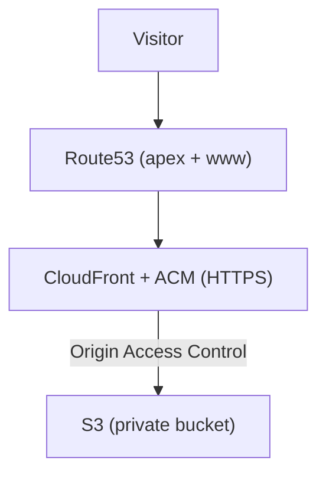
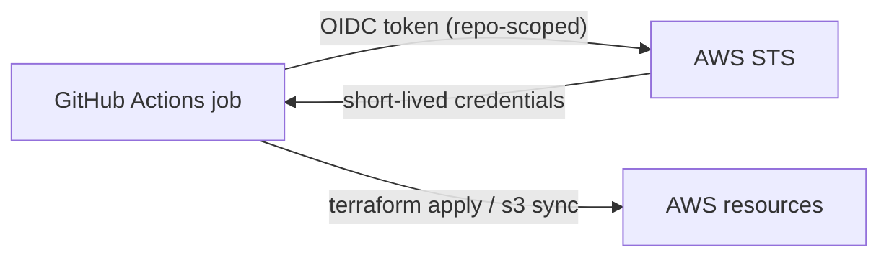

# Deploying a Static Site to AWS with Terraform and GitHub OIDC

The fast way to deploy from CI is to create an AWS access key, paste it into a GitHub secret, and move on. It works in five minutes. It is also a long-lived credential with standing permissions sitting in a settings page, and it will still be there, valid, the day someone leaks a workflow log.

This site (the one you are reading) deploys without a single static key. The pipeline authenticates to AWS with short-lived credentials it requests per run, scoped to one repository. Here is the whole setup, and the two gotchas that turned a quick job into an afternoon.

## In plain terms

Instead of handing CI a permanent key to the house, you give it the right to ask a guard for a key that works for a few minutes and only opens one door. Every run asks again. There is nothing to leak, because there is no lasting key to steal.

## What gets deployed

The site is static files. The infrastructure around them, all in Terraform:

- **S3** holds the built site, as a private bucket.
- **CloudFront** serves it over HTTPS, with the bucket locked behind an Origin Access Control so it is not public.
- **ACM** issues the TLS certificate (in us-east-1, which CloudFront requires).
- **Route53** points the apex and www at the distribution.

## Decision 1: OIDC instead of stored keys

GitHub Actions can present a signed OpenID Connect token to AWS. You create an IAM role whose trust policy accepts that token, but only from your repository, and the workflow assumes the role at runtime. AWS hands back temporary credentials that expire when the job ends.

No keys are stored anywhere. The trust is scoped with a condition on the token's `sub` claim, so only this repo (and the branches I choose) can assume the role. Leaking a build log leaks nothing reusable.

## Decision 2: remote state, and the bootstrap chicken-and-egg

For the pipeline to run Terraform, two things must already exist: somewhere to keep state (an S3 backend plus a lock table) and the OIDC role itself. Neither can be created by the pipeline that depends on them.

So there is a small, separate **bootstrap** that runs once, locally, with my own credentials. It creates the state bucket, the lock table, the GitHub OIDC provider and the roles, and nothing else. After that, the bootstrap is never touched and everything else flows through CI. One deliberate manual step buys a fully automated pipeline forever after.

## Decision 3: plans on a PR, applies on merge

The workflow is boring on purpose, which is the highest compliment infrastructure can earn:

- Open a pull request: CI runs `fmt`, `validate` and `plan`, so the change is reviewable as a diff.
- Merge to `main`: CI runs `apply` with the OIDC role.

The state lives in the shared backend, so local and CI never fight over it. Infrastructure changes the same way application code does: through a reviewed pull request, not a console.

## The two gotchas

**1. A private bucket behind CloudFront does not serve directory indexes.** With S3 static-website hosting, requesting `/cases/` quietly returns `/cases/index.html`. Lock the bucket behind an Origin Access Control and that convenience disappears: the REST origin gets asked for an object literally named `cases/` and returns nothing. The fix is a tiny CloudFront Function on the viewer request that appends `index.html` to directory-style paths. Obvious in hindsight, invisible until every nested page 404s.

**2. ACM validation hung because the domain pointed at the wrong zone.** The certificate sat in `PENDING_VALIDATION` forever. The DNS validation records were correct and matched what ACM expected exactly, but they would not resolve on the public internet. The cause: the registered domain delegated to an old set of nameservers, not the hosted zone Terraform was writing to. The tell was simple once I looked: the records were right in the zone, but `dig @8.8.8.8` returned nothing, which means "the world is not looking at this zone." Repointing the domain's nameservers fixed it in minutes. Lesson: when DNS validation stalls, stop staring at the record values and check the delegation first.

## What I would do differently

Codify the domain's nameserver delegation in Terraform too (it is currently set once by hand), so it cannot drift back to an old zone and reintroduce exactly the failure above.

## The transferable lesson

"Put the key in a secret" is the default, and defaults are where risk accumulates. OIDC turns CI authentication from a stored secret into a short-lived, scoped request, and it is not meaningfully harder to set up once you have done it once. Pair it with remote state and a PR-driven pipeline and the whole thing becomes the boring, auditable, leak-resistant baseline that infrastructure should be.

> The Terraform for this site is public: [github.com/NicolasAndresCalvo/portfolio-infra](https://github.com/NicolasAndresCalvo/portfolio-infra).

---

*A personal project. No account identifiers or secrets are included.*
