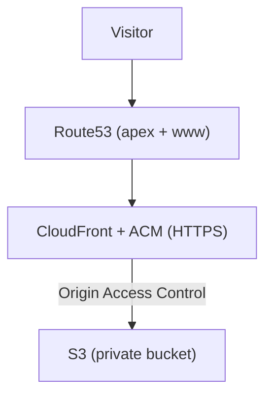
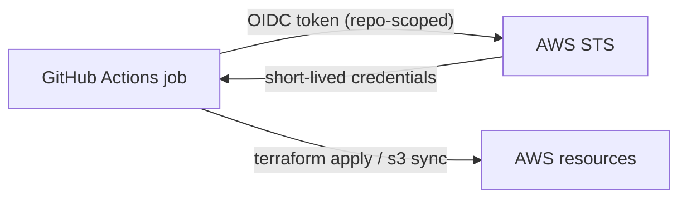

# A Production-Grade Site for $0.50 a Month: Terraform + GitHub OIDC on AWS

> **TL;DR** This site runs on AWS with HTTPS, a global CDN, and a pipeline that deploys on every push, using **short-lived credentials and zero stored keys**. Infrastructure cost: **about $0.50 a month**. The whole thing is Terraform, and the repo is public.

Two beliefs cost teams real money and real risk. The first: production hosting is expensive. The second: the way to deploy from CI is to paste an AWS access key into a secret and move on. Both are wrong, and this site is the proof.

It serves over HTTPS from a global CDN, deploys itself on every `git push`, and authenticates to AWS with credentials that expire when the job ends. There is no long-lived key anywhere to leak. It costs roughly **fifty cents a month**. Here is exactly how, including the cost breakdown and the two gotchas.

## In plain terms

Instead of giving the deploy robot a permanent key to the building, you give it the right to ask a guard for a key that works for a few minutes and opens one door. Every deploy asks again. Nothing lasting exists to steal. And the "building" is rented by the request, so an empty site costs almost nothing.

## What you get

- 🔒 **HTTPS** on a custom domain, certificate auto-renewed.
- 🌍 **Global CDN** (CloudFront) in front of a **private** bucket.
- 🧱 **All Terraform**, in a public repo, reviewed as pull requests.
- 🤖 **Deploys on push** to `main`, no human in the loop.
- 🔑 **No static AWS keys** anywhere: short-lived OIDC credentials per run.
- 💸 **~$0.50/month.**

## What it costs

The number that sells this: a production-grade setup, for the price of a coffee per year.

| Piece | Cost |
|------|------|
| Route53 hosted zone | $0.50 / month |
| S3 (storage + requests) | a few cents |
| CloudFront | $0 (the 1 TB/month free tier covers a portfolio) |
| ACM certificate | free |
| **Infrastructure total** | **~$0.50 / month** |
| Domain (.com), separate | ~$12 / year |

CloudFront's perpetual free tier (1 TB out and 10M requests a month) means a personal or small-business site effectively pays nothing for delivery. The only standing charge is the Route53 hosted zone. That is the whole bill.

## The architecture

Static files in a private bucket, a CDN putting them behind HTTPS and the domain. Nothing is public except CloudFront.

## OIDC instead of stored keys

GitHub Actions can present a signed OpenID Connect token to AWS. You create an IAM role that trusts that token, but only from your repository, and the workflow assumes it at runtime. AWS returns temporary credentials that die with the job.

Nothing is stored. The trust is scoped with a condition on the token, so only this repo can assume the role. Leak a build log and you leak nothing reusable. This is the single highest-leverage security upgrade most pipelines are missing, and it is a one-time setup.

## Remote state, and the bootstrap chicken-and-egg

For the pipeline to run Terraform, two things must already exist: a state backend (an S3 bucket plus a lock table) and the OIDC role itself. Neither can be created by the pipeline that needs them.

So a small **bootstrap** runs once, locally, and creates exactly those: state bucket, lock table, OIDC provider, roles. After that it is never touched. One deliberate manual step buys a fully automated pipeline forever.

## Plan on a PR, apply on merge

- **Pull request:** CI runs `fmt`, `validate` and `plan`, so every change is a reviewable diff.
- **Merge to `main`:** CI runs `apply` with the OIDC role.

Infrastructure changes the same way code does: through review, not a console. (I felt the payoff first-hand: my local AWS session expired mid-project, I pushed anyway, and CI deployed it with no credentials of mine involved.)

## The two gotchas

**1. A private bucket behind CloudFront does not serve directory indexes.** With S3 website hosting, `/cases/` quietly returns `/cases/index.html`. Lock the bucket behind an Origin Access Control and that magic disappears: the origin gets asked for an object named `cases/` and returns nothing. Fix: a tiny CloudFront Function on the viewer request that appends `index.html` to directory paths. Invisible until every nested page 404s.

**2. ACM validation hung because the domain pointed at the wrong zone.** The certificate sat in `PENDING_VALIDATION` forever. The validation records were correct and matched what ACM expected, but they would not resolve publicly. The domain delegated to an old set of nameservers, not the zone Terraform was writing to. The tell: the records were right in the zone, but `dig @8.8.8.8` returned nothing, which means the world is not looking at this zone. Repointing the nameservers fixed it in minutes. When DNS validation stalls, check the delegation before the values.

## What I would do differently

Codify the domain's nameserver delegation in Terraform too, so it cannot drift back to an old zone and reintroduce that exact failure.

## The lesson

"Production-grade" and "expensive" are not the same thing, and "convenient" and "secure" do not have to trade off. Static hosting on a CDN is pennies. OIDC turns CI auth from a stored secret into a short-lived, scoped request. Put them together with Terraform and a PR-driven pipeline and you get the boring, auditable, leak-resistant, near-free baseline that every project deserves.

> The Terraform for this site is public: [github.com/NicolasAndresCalvo/portfolio-infra](https://github.com/NicolasAndresCalvo/portfolio-infra).

---

*A personal project. No account identifiers or secrets are included. Prices are AWS list-price approximations.*
