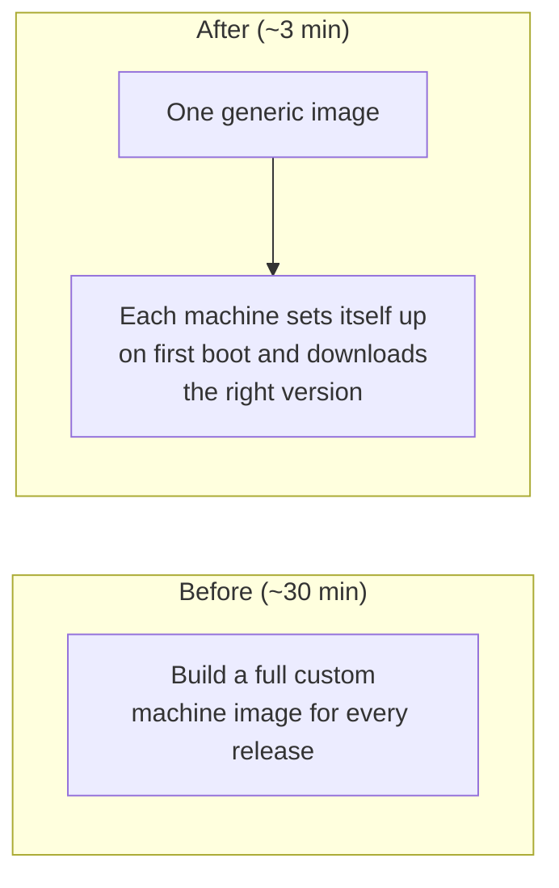
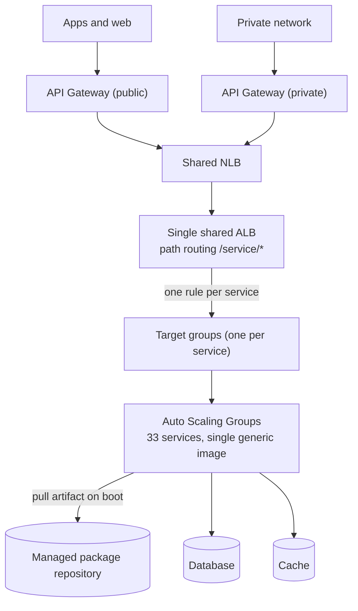
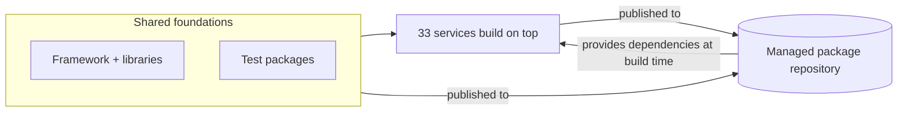

# Zero-Downtime Across AWS Regions: The Decisions Behind Moving 33 Production Microservices

> **TL;DR** A region migration looks like a redeploy. The hard part is everything the old region quietly assumed. 33 production microservices moved with **zero downtime**, releases went from **30 minutes to 3**, and a single shared load balancer cut that cost by about **90%**. Below are the decisions that made it possible, and the ones that hurt.

There is a comforting way to describe a cloud region migration. You have a stack running in region A, you stand it up in region B, you point traffic at the new one, and you switch the old one off. On a slide it is an arrow between two boxes.

That picture is wrong in the way that matters. The destination is rarely the hard part. The hard part is everything the old region quietly assumed, and the fact that you are not allowed to stop serving customers while you unwind those assumptions.

This is the story of moving an airline's platform for flight add-ons (seat selection, extra baggage, insurance, loyalty) out of an aging region and into the company's standard cloud. 33 microservices, about twelve months, one hard constraint: **zero downtime**. No companies are named here on purpose. The point is the decisions, not the logo.

---

## In plain terms

Picture a shop's checkout add-ons running in an old, expensive warehouse that is separate from the rest of the company. The job was to move all of it into the company's modern, standard home, make it cheaper and simpler on the way, and never once close the shop.

We did exactly that: **33 services moved with zero downtime**, releases became roughly **10x faster**, and the running cost dropped sharply. The interesting part is *why* each decision was made, so here is the reasoning, including the parts that hurt.

## What the old region assumed

Before you can move a system, you have to see the assumptions baked into it. The legacy setup was not badly built. It was built for a world that no longer applied, and every one of those assumptions became a task:

- **One repository held everything**, with the infrastructure code copied for every service in every environment. 33 services across 5 environments meant **150+ near-duplicated directories** of Terraform.
- **Every release baked a complete, ready-to-run machine image** with Packer and Ansible. There were **1000+ machine images**, each one a disk snapshot that bills every month.
- **Each service had its own load balancer**, close to one per service per account.
- **A self-hosted artifact server** (running on build machines physically in the old region) held every internal library. It needed manual setup per service, used fixed passwords, and was a single point of failure.
- **Delivery used bespoke, hand-maintained CI actions** and stored passwords.

Read that list again as a single sentence: the platform assumed it lived in that one region, on those machines, behind that server. A migration is really a forced audit of every such assumption.

## The constraint that shaped everything: zero downtime

If a maintenance window had been acceptable, most of this would have been straightforward. It was not. The platform sells things to travellers around the clock, so the migration had to be invisible to them.

Zero downtime is not a feature you add at the end. It is a constraint that decides your architecture up front, because it rules out the simplest plan (turn region A off, turn region B on) and forces you to run both at once until you are certain.

## Decision 1: run both regions in parallel, and accept paying twice

The cutover was Blue/Green across regions. A single delivery pipeline deployed to **both the old region and the new one at the same time**, health-checked both, and only shifted traffic once the new side was proven. If anything looked wrong, the old side was still live and serving.


**The trade-off, stated honestly:** running two full infrastructures side by side means paying for the workload twice for as long as the overlap lasts. Zero downtime is worth that price, but the duplicated cost is real and has to be budgeted up front, with the overlap window kept as short as possible per service. This is the cost nobody puts on the migration slide.

## Decision 2: stop baking a machine image per release

This was the single biggest speed win, and it came from questioning an assumption rather than optimizing it.

The old way baked a complete, ready-to-run machine image for **every** release. Building one took **over 30 minutes**, and the result was yet another snapshot to store. The assumption underneath it was that a release *is* an image.

We dropped that. Instead of baking the application into the image, we ship **one generic image plus a small startup script that runs the first time each machine boots**. On boot, the machine downloads the right version of the application and starts it.



It is the difference between shipping a fully furnished house every time and shipping an empty house that furnishes itself on arrival. Releases dropped to **about 3 minutes**, roughly **10x faster**, which also shortens the disruption window during a production release. As a side effect, **1000+ stored images collapsed into a single maintained one**, removing all that recurring snapshot storage.

## Decision 3: one shared, path-routing load balancer instead of one per service

The old region ran close to one balancer per service, near 39 per account. At roughly 16 to 20 USD per month each, that is around **730 USD per month per account**, repeated across three environments.

We replaced that with **a single shared application load balancer that routes by path** to one target group per service. The new bill per account is near **80 USD**: roughly **90% less**, for the same routing.



The lesson here is mundane and worth a lot of money: "one balancer per service" feels clean, but a path-routing balancer gives you the same isolation at a fraction of the cost.

## Decision 4: replace the self-hosted artifact server with a managed one

The internal libraries lived on a self-hosted artifact server. It worked, but it carried hidden tax: manual setup per service, fixed passwords, machines to patch and keep online, and a single point of failure. Worse, it was physically tied to the region we were leaving.

We moved everything onto a managed cloud package repository (AWS CodeArtifact). It scales on its own, authenticates with short-lived automatic credentials instead of stored passwords, and proxies public dependencies through a single cache so every project resolves them the same way.

This was the least glamorous and most laborious part. The services are built on an internal Spring Boot framework plus reusable build and test packages, and nothing could simply be copied across. I recompiled and re-published the framework libraries, the test packages and all 33 services **in dependency order** (foundations first, then everything that builds on them), updated every project's build file, and removed every hardcoded reference to the old server. Build and publish time also dropped by about half.



## Decision 5: collapse 150+ infrastructure folders into 2 modules

The duplicated Terraform was not just untidy, it was a liability: 150+ folders meant 150+ places for the same change to drift. We deduplicated it into **2 reusable modules** (one for the per-service compute, one for the shared backbone of database, cache and gateways) with thin per-environment consumers that just pin the module versions.

```text
# BEFORE: one repository, Terraform copied per service per environment
platform/
└── iac/
    ├── <service>/        # one folder per service ...
    ├── api-gateway/      # ... per environment
    ├── infra/
    └── modules/
#  33 services x 5 environments  =>  150+ duplicated directories

# AFTER: small repositories, one responsibility each
platform/
├── infra-module/        # reusable: compute (for_each over 33 services)
├── shared-module/       # reusable: database, cache, API gateways, DNS
├── workloads-infra/     # thin consumer, pins versions: int / pre / prod
├── shared-infra/        # thin consumer: VPC + shared module, per environment
└── delivery/            # registry, package repo, runners, image build
#  150+ directories  =>  2 reusable modules + thin per-environment consumers
```

## The results

- **33 microservices migrated with zero downtime** over about twelve months.
- **Releases roughly 10x faster**: over 30 minutes down to about 3.
- **1000+ machine images replaced by one** shared across every environment.
- **150+ infrastructure folders consolidated into 2** reusable modules.
- **Around 90% lower load balancer cost** per environment.
- **Logs cleaned up:** a duplicated, high-cost log stream (billing around 3,800 USD per month) was removed once we confirmed the same logs already lived in the company's observability platform.
- **Compute about 20% cheaper** by moving the fleet to AWS Graviton (ARM), with up to 40% better price for performance, plus right-sizing each service to its instance.
- **No more stored passwords** in delivery: short-lived automatic credentials throughout.

## What was hard, and what I would do differently

A write-up is more honest, and more useful, when it includes the rough edges.

- **Running two infrastructures in parallel is expensive while it lasts.** A Blue/Green cutover across regions means paying for the workload twice for a while. Zero downtime is worth it, but that overlap cost should be budgeted explicitly and the window kept as short as possible per service, not left to drift.
- **The timeline slipped because legacy hides its scope.** The original dates moved as we kept finding work that was not in the headline plan: networking quirks, gateway behaviours, and dependencies that only surfaced once we were deep inside the old system. Migrating legacy carries a lot of undiscovered scope. I would now plan explicit discovery time and treat the initial scope as a starting point, not a complete picture.

## The transferable lesson

A region migration is not a redeploy. It is a forced audit of every assumption your platform made about *where* it runs: the images it bakes, the servers it leans on, the way it bills for routing. The move is the deadline that finally makes you fix them. The zero-downtime constraint is what stops you from cutting corners while you do.

---

*Names, identifiers and exact internal figures are generalized. Costs are list-price approximations, meant to show the order of magnitude.*
